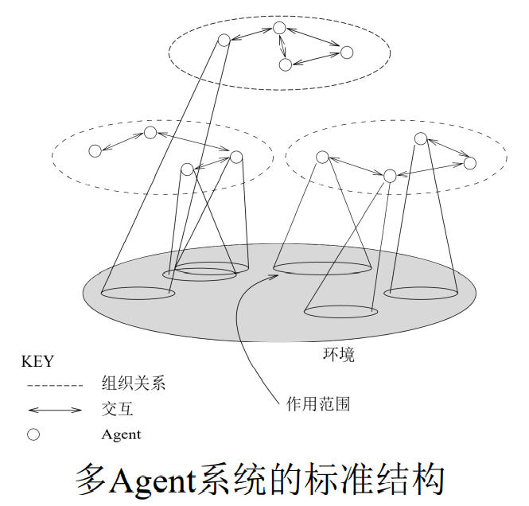
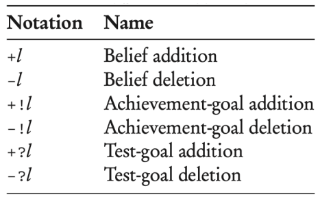
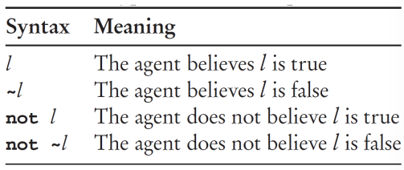
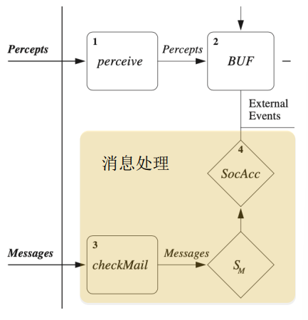

[TOC]

#### 1 多Agent系统引言

##### 1.1 多Agent系统的出现

计算历史的5个发展趋势：普适（Ubiquity）、互联（Interconnection）、智能（Intelligence）、代理（Delegation）、人性化（Human-orientation）

Agent的定义：一个计算机系统，有代表用户或者所有者 独立动作的能力

Agent具有的两种重要能力：自治行动&交互

多Agent系统（Multi-Agent Systems, MAS）：由多个Agent组成的系统，它们可以彼此交互

##### 1.2 对多Agent系统的认识

Agent作为一种软件工程范型

Agent作为理解人类社会的工具:DeepMind在2018年提出了机器心智理论

##### 1.3 多Agent系统的应用

会下棋的多Agent系统:蒙特卡洛树搜索

会玩非完美信息博弈的多Agent系统:德州扑克，麻将、星际争霸

#### 2 智能自治Agent

##### 2.1 智能Agent

环境的分类：

- 完全可观察的与部分可观察的
- 单Agent与多Agent
- 确定的与随机的
- 片段式的与序贯式的
- 静态的与动态的
- 连续的与离散的

智能Agent的属性：

- 反应性（Reactivity）
- 预动性（Proactiveness）
- 社会能力（Social Ability）
- 其他

作为意识系统(Intentional System)的Agent

设计方法：

- 显式编程
- 监督学习
- 优化
- 规划
- 强化学习

一些应用：深度Q网络(DQN)

###### 2.2 智能Agent的体系结构

Agent = 体系结构 + 程序

Agent的抽象体系结构:

假设环境是任何离散的瞬时状态的有限集合E

假设Agent有一个可执行动作的清单*Ac*，它们改变环境的状态

Agent在环境中的一次运行（run）r是环境状态与动作交替的一个序列

状态转移函数τ表示Agent的动作作用于环境的效果

形式上，环境𝐸是一个三元组𝐸 =< 𝐸, $𝑒_0$, 𝜏 > 

Agent模型是一个把运行映射到动作的函数

##### 2.3 演绎推理Agent

##### 2.4 实用推理Agent

###### 2.5 反应式agent

本质上就是考虑情景与其相应的动作，而组织形式是层次结构

优点：简单

局限性：

- 需要充分可用的信息
- 对未知不具备决策能力
- 工程上难以实现（情况太复杂）
- 构造一个包含多层的Agent困难

##### 2.6 混合式Agent

用至少两个子系统：慎思式子系统和反应式子系统

通常，反应式子系统的优先级更高

各个子系统被排列成层级间相互交互的等级结构

分成两种集成方式：

- 水平层次结构
  - 通过一个仲裁函数来决定交给哪一层来控制
  - 层数多时，仲裁函数的复杂程度可能成为瓶颈
  - Touring机

- 垂直层次结构
  - 线性的，控制流依次经过每个层
  - 解决了仲裁的麻烦，但是不能容错，一错全错
  - InteRRap

#### 3 通讯与合作

本体论（前置课程：知识表示与推理）

本体按可复用性从低到高可划分为三个层次：

- 应用本体
- 领域本体
- 上层问题

基于常识，一个本体越具体，复用性就越低

XML(eXtensible Mackup Language)

- POMDP 部分可观察马尔可夫过程

OWL(Web Ontology Language)

KIF(Knowledge Interchange Format)

- KIF严格基于一阶逻辑（谓词逻辑）

构建本体(可以遵循Noy and McGuinness):

- 确定领域和范围 
- 考虑复用 
- 列举关键术语 
- 定义类和类的层次结构
- 定义属性 
- 定义属性上的约束 
- 创建实例

##### 3.4 实践：使用Jason解释器的多Agent编程

###### 多Agent编程语言概览

**智能Agent**应该具有的属性：

- 自治性
- 预动性
- 反应性
- 社会能力

**多Agent系统**包含一些Agent：

- 通过通信相互交互
- 有不同的“作用范围”
- 影响的范围可能重叠
- ......

如何设计多Agent编程语言？

应当具有下面这些**性质**：

- 这门语言需要支持目标层面的委托（delegation） 
- 这门语言能够提供目标导向型的问题解决方法
- 这门语言能够产生反应式系统
- 这门语言能够集成目标导向式和反应式行为
- 这门语言需要支持知识层面的通信与合作行为

**AgentSpeak**：具有这些性质的多Agent编程语言

**Jason**：AgentSpeak语言的实现/解释器/开发环境

###### Jason语法简介

基于BDI体系结构(beliefs,desires,intentions)

Jason语言中的三个主要结构：

- 信念

  - Agent有一个信念库（belief base）

  - 信念反映了Agent的某些认知（不见得是真实情况），常常以逻辑编程的形式表示：tall(john). likes(john, music).

  - 在信念后添加**标注**（annotation）可以更好的表示某些具体的信念，如下面的语句：busy(john)[expires(autumn)].

  - 可以用**source标注**记录信息来源：likes(john,music)[source(john)].

**3种类型的Source标注**：感知信息[source(percept)]，通信 [source(agentID)]，读心记事 [source(self)]，若未标注，则默认读心记事

**强否定vs弱否定**：在语句前添加~以表示强否定，对应地，在语句前加not表示弱否定。弱否定表示Agent对该语句没有信念(可能真可能假)，而强否定表示Agent认定该语句一定为假

**规则**：基于信念的逻辑表示，可以定义新的规则(rule)，例子，a :- b 如果b成立，则a成立

**基于信念和规则的推理**：基于一组信念和规则，可以推理出新的信念

- 目标

目标表示Agent想要得到具有某些属性的世界状态

- **成就目标**（achievement goal）：是Agent想要完成的，目前Agent不认为这个目标是完成的（即它不在Agent的当前信念中），通常在语句前加“!”如!own(house)
- **测试目标**（test goal）：类似于Prolog语言中的目标（或查询），通常在语句前加“?”，如?bank_balance(BB)，其中BB为变量，表示需要确定变量BB的值使得语句为Agent的当前信念

- 规划

规划是一份Agent可执行动作的清单，表示Agent如何完成 某个指定的目标

triggering event: context <- body

- 触发事件（triggering event）：该规划用于应对何种事件
  - 
- 上下文（context）：在何种上下文时可使用该规划
  - 
- 规划体（body）：当事件触发且上下文满足时，应当执行的内容
  - 动作是体现在规划中的Agent与环境交互的手段

实例：+!at(Coordinates): not at(Coordinates) & ~unsafe_path(Coordinates) <- move_towards(Coordinates); !at(Coordinates).

###### Jason中的通信与交互

在AgentSpeak中，Agent的通信结构相较于KQML/ACL更为简单，其信息结构为：

<sender, performative, content> 注：语用词（performative）：表示发送者发送该消息期望达成的目标

在Jason中，常用的发送消息的动作：

- .send(sender, performative, content)
- .broadcast(performative, content)

Jason的消息处理

Jason中的语用词

- 共享信念（信息交换型）
  - tell/untell: 发送者想要接收者相信/不相信消息内容，且这一信念 是发送者本身相信的
- 共享规划（慎思型）
  - tellHow/untellHow: 发送者请求接收者（不）接受内容中的规划
  - askHow: 发送者想要知道接收者关于指定事件的规划
- 委派一个成就目标（目标委派型）
  - achieve/unachieve: 发送者希望接收者完成/撤销消息内容中的目标
- 委派一个测试目标（信息查询型）
  - askOne/askAll: 发送者想要知道接收者是否知道消息内容中的一个                                                                                      答案/所有答案

Jason允许Agent的开发者自定义语用词

###### Jason编程实例 – 家政机器人

wait to be done

**Jason编程实例 – 合同网协议**   

wait to be done                                                                                                                                                                                                              