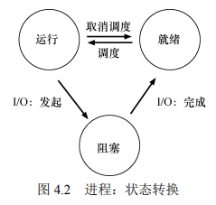
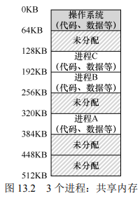
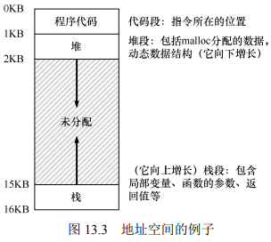

[TOC]

##### Preface

操作系统三大专题：**虚拟性**(virtualization)，**并发性**(concurrency)，**持久性**(persistence)

##### 1 Dialogue

> I Hear And I Forget. I See And I Remember. I Do And I Understand.
>
> 不闻不若闻之，闻之不若见之，见之不若知之，知之不若行之1。
>
> ——荀子

##### 2 Introduction

当一段程序运行的时候，究竟发生了什么：

取指—译码—执行(fetch-decode-execute)

OS的目的是为了更好的运行程序

为了让用户可以告诉操作系统做什么，操作系统一般会提供一些接口interfaces(APIs)来让用户调用，这些接口也叫做system calls，这些接口统称为一个标准库

虚拟性使得很多程序得以在cpu上运行，并且可以并发地获取它们相应的指令与数据，以及共用设备等，OS有时也被叫做资源管理器。cpu/memory/disk是系统的资源，因此操作系统的作用就是去管理这些资源。

虚拟cpu使得多个程序同时运行。

虚拟mem使得程序之间不会互相干扰。操作系统将虚拟地址(virtual address space)映射到物理地址。(linux and macos都会采用虚拟地址随机化来防止攻击，具体见ostep)

多线程在并发情况下的问题

设计和实现操作系统的目的：高性能，提供保护...

os历史：

早期操作系统：只是一些库

超越库：保护，系统调用与内核

多道程序时代：内存保护，同时载入很多程序

当今：unix

##### 3 关于虚拟化的对话

虚拟化就是把一个资源虚拟成多个资源，让每个应用都以为自己在独占资源

##### 4 抽象：进程

进程的非正式定义：进程就是运行中的程序

> 关键问题：如何提供有许多CPU的假象？

通过让一个进程只运行一个时间片，然后切换到其他进程。

要实现CPU的虚拟化，操作系统就需要一些低级机制以及一些高级智能.机制(mechanism)就是一些低级方法或协议，实现了所需的功能。比如上下文切换(context switch)这种分时机制。

> 提示：使用时分共享(和空分共享)

在这些机制之上，操作系统有一些智能以策略(policy)的形式存在。策略就是在操作系统内做出某种决定的算法。比如，给定一组可能的程序要在CPU上运行，操作系统应该运行哪个程序？操作系统中的调度策略(scheduling policy)会做出这样的决定，可能利用历史信息、工作负载知识以及性能指标来做出决定。

4.1 抽象进程

操作系统为正在运行的程序提供的抽象，就是所谓的进程(process)。为了理解构成进程的是什么，我们必须理解它的机器状态：程序在运行时可以读取或更新的内容。

- 内存（指令以及读取、写入的数据都在内存中）
- 寄存器（程序计数器PC、栈指针、帧指针等）
- 持久存储设备（当前打开的文件列表）

> 提示：分离策略与机制
>
> 机制为系统的how问题提供答案，策略为系统的which问题提供答案
>
> 将两者分开可以轻松得改变策略、而不必重新考虑机制，因此这是一种模块化的形式，一种通用的软件设计原则。

4.2 进程API

操作系统所有进程相关的接口必须包含哪些内容：

- 创建(create)：创建一些新进程的方法
- 销毁(destory)：强制销毁进程的接口
- 等待(wait)：等待进程停止运行
- 其他控制(miscellaneous control)：例如，暂停进程，然后恢复
- 状态：获得有关进程的状态信息，例如运行了多长时间，或者处于什么状态

4.3 进程创建：更多细节

问题：程序如何转化为进程？具体来说，操作系统如何启动并运行一个程序？进程创建实际如何进行？

必须做的第一件事是将代码和所有静态数据（例如初始化变量）加载(load)到内存中，加载到进程的地址空间中。程序最初以某种可执行格式驻留在磁盘上(disk)，因此，加载的过程，需要操作系统从磁盘读取这些字节，然后将它们放在内存中的某处。

将代码和静态数据加载到内存后，操作系统在运行此进程之前还需要执行其他一些操作。必须为程序的运行时栈(run-time stack 或 stack)分配一些内存。操作系统分配这些内存，并提供给进程。操作系统也可能会用参数初始化栈。具体来说，它会将参数填入main()函数，即argc和argv数组。

操作系统也可能为程序的堆(heap)分配一些内存。

操作系统还将执行一些其他初始化任务，特别是与输入/输出(I/O)相关的任务。例如，在UNIX系统中，默认情况下每个进程都有3个打开的文件描述符(file descriptor)，用于标准输入、输出和错误。这些描述符让程序轻松读取来自终端的输入以及打印输出到屏幕。

然后操作系统还有最后一项任务：启动程序，在入口处运行，即main()。通过跳转到main()例程，操作系统将CPU的控制权转移到新创建的进程中。

4.4 进程状态

进程在给定时间可能处于的不同状态(state)：

- 运行(running)：进程正在处理器上运行
- 就绪(ready)：在就绪状态下，进程已准备好运行，但由于某种原因，操作系统选择不在此时运行
- 阻塞(blocked)：在阻塞状态下，一个进程执行了某种操作，直到发生其他事件时才会准备运行。一个常见的例子是，进程向磁盘发起I/O请求

将这些状态映射到一个图上



4.5 数据结构

操作系统有一些关键的数据结构来跟踪各种相关的信息。例如，为了跟踪每个进程的状态，操作系统可能会为所有就绪的进程保留某种进程列表(process list)，以及跟踪当前正在运行的进程的一些附加信息。操作系统还必须以某种方式跟踪被阻塞的进程。

查看xv6内核的进程结构。可以看到操作系统追踪的一些重要信息，比如寄存器上下文。还可以看到，除了运行、就绪和阻塞之外，还有一些进程可以处于的状态，比如初始(initial)状态——表示进程在创建时处于的状态，最终(final)状态(在基于UNIX的系统中，这称为僵尸(zombie)状态)表示——表示进程已退出但尚未处理的状态。

> 补充：数据结构——进程列表
>
> 存储关于进程的信息的个体结构称为进程控制块(Process Control Block，PCB)

##### 5 插叙：进程API

本章将介绍更多系统实践方面的内容。

> 关键问题：如何创建并控制进程？

UNIX系统采用了一种非常有趣的创建新进程的方式，即一对系统调用：fork()和exec()，进程还可以通过第三个系统调用wait()，来等待其创建的子进程执行完成。

5.1 fork()系统调用

```c
#include <stdio.h>
#include <stdlib.h>
#include <unistd.h>

int main(int argc, char *argv[]) {
    printf("hello world (pid:%d)\n", (int) getpid());
    int rc = fork();
    if (rc < 0) {
        // fork failed; exit
        fprintf(stderr, "fork failed\n");
        exit(1);
    } else if (rc == 0) {
        // child (new process)
        printf("hello, I am child (pid:%d)\n", (int) getpid());
    } else {
        // parent goes down this path (original process)
        printf("hello, I am parent of %d (pid:%d)\n",
	       rc, (int) getpid());
    }
    return 0;
}
```

进程调用fork()系统调用时，新创建的进程几乎与调用进程完全一样，对操作系统来说，这时看起来有两个完全一样的程序在运行，**并都从fork()系统调用中返回**，但是从fork()返回的值是不同的。父进程获得的返回值是新创建子进程的PID，而子进程获得的返回值是0。

5.2 wait()系统调用

```c
#include <stdio.h>
#include <stdlib.h>
#include <unistd.h>
#include <sys/wait.h>

int main(int argc, char *argv[]) {
    printf("hello world (pid:%d)\n", (int) getpid());
    int rc = fork();
    if (rc < 0) {
        // fork failed; exit
        fprintf(stderr, "fork failed\n");
        exit(1);
    } else if (rc == 0) {
        // child (new process)
        printf("hello, I am child (pid:%d)\n", (int) getpid());
	sleep(1);
    } else {
        // parent goes down this path (original process)
        int wc = wait(NULL);
        printf("hello, I am parent of %d (wc:%d) (pid:%d)\n",
	       rc, wc, (int) getpid());
    }
    return 0;
}
```

父进程调用wait()，延迟自己的执行，直到子进程执行完毕。当子进程结束时，wait()才返回父进程。

5.3 最后是exec()系统调用

```c
#include <stdio.h>
#include <stdlib.h>
#include <unistd.h>
#include <string.h>
#include <sys/wait.h>

int main(int argc, char *argv[]) {
    printf("hello world (pid:%d)\n", (int) getpid());
    int rc = fork();
    if (rc < 0) {
        // fork failed; exit
        fprintf(stderr, "fork failed\n");
        exit(1);
    } else if (rc == 0) {
        // child (new process)
        printf("hello, I am child (pid:%d)\n", (int) getpid());
        char *myargs[3];
        myargs[0] = strdup("wc");   // program: "wc" (word count)
        myargs[1] = strdup("p3.c"); // argument: file to count
        myargs[2] = NULL;           // marks end of array
        execvp(myargs[0], myargs);  // runs word count
        printf("this shouldn't print out");
    } else {
        // parent goes down this path (original process)
        int wc = wait(NULL);
        printf("hello, I am parent of %d (wc:%d) (pid:%d)\n",
	       rc, wc, (int) getpid());
    }
    return 0;
}
```

这个系统调用可以让子进程执行与父进程不同的程序。在上述例子中，子进程调用execvp()来运行字符计数程序wc。

给定可执行程序的名称（如wc）及需要的参数后，exec()会从可执行程序中加载代码和静态数据，并用它覆写自己的代码段（以及静态数据），堆、栈及其他内存空间也会被重新初始化。然后操作系统就执行该程序，将参数通过argv传递给该进程。因此，它并没有创建新进程，而是直接将当前运行的程序替换为不同的运行程序（wc）。子进程执行exec()之后，几乎就像原程序从未运行过一样。对exec()的成功调用永远不会返回。

5.4 为什么这样设计API

事实证明，这种分离fork()及exec()的做法在构建UNIX shell的时候非常有用，因为这给了shell在fork之后exec之前运行代码的机会，这些代码可以在运行新程序前改变环境，从而让一系列有趣的功能很容易实现。

> 提示：重要的是做对事(LAMPSON定律)
>
> 做对事。抽象和简化都不能替代做对事。

fork()和exec()的分离，让shell可以很方便地实现很多有用的功能。

比如重定向，

```shell
prompt> wc p3.c > newfile.txt
```

当shell完成子进程的创建后，shell在调用exec()之前先关闭了标准输出，打开了文件newfile.txt。

以下展示了这样做的一个程序，

```c
#include <stdio.h>
#include <stdlib.h>
#include <unistd.h>
#include <string.h>
#include <fcntl.h>
#include <assert.h>
#include <sys/wait.h>

int main(int argc, char *argv[]) {
    int rc = fork();
    if (rc < 0) {
        // fork failed; exit
        fprintf(stderr, "fork failed\n");
        exit(1);
    } else if (rc == 0) {
	// child: redirect standard output to a file
	close(STDOUT_FILENO); 
	open("./p4.output", O_CREAT|O_WRONLY|O_TRUNC, S_IRWXU);

	// now exec "wc"...
        char *myargs[3];
        myargs[0] = strdup("wc");   // program: "wc" (word count)
        myargs[1] = strdup("p4.c"); // argument: file to count
        myargs[2] = NULL;           // marks end of array
        execvp(myargs[0], myargs);  // runs word count
    } else {
        // parent goes down this path (original process)
        int wc = wait(NULL);
	assert(wc >= 0);
    }
    return 0;
}
```

UNIX管道也是用类似的方式实现的，但用的是pipe()系统调用。

在这种情况下，一个进程的输出被链接到了一个内核管道（pipe）上（队列），另一个进程的输入也被连接到了同一个管道上。因此，前一个进程的输出无缝地作为后一个进程的输入，许多命令可以用这种方式串联谁一起，共同完成某项任务。比如通过将grep、wc命令用管道连接可以完成从一个文件中查找某个词，并统计其出现次数的功能：grep -o foo file | wc -l。

> 补充：RTFM——阅读man手册
>
> 花时间阅读man手册是系统程序员成长的必经之路。手册里有许多有用的隐藏彩蛋。

5.5 其他API

除了以上提到的，在UNIX中还有其他许多与进程交互的方式。比如通过kill()系统调用向进程发送信号（signal），包括要求进程睡眠、终止或其他有用的指令。

##### 6 机制：受限直接执行

直接运行协议

| 操作系统                | 程序               |
| ----------------------- | ------------------ |
| 在进程列表中创建条目    |                    |
| 为程序分配内存          |                    |
| 将程序加载到内存中      |                    |
| 根据argc/argv设置程序栈 |                    |
| 清除寄存器              |                    |
| 执行call main()方法     |                    |
|                         | 执行main()         |
|                         | 从main中执行return |
| 释放进程的内存          |                    |
| 将进程从进程列表中清除  |                    |

问题1：操作系统怎么能确保程序不做任何我们不希望它做的事，同时仍然高效地运行它？

问题2：操作系统如何让它停下来并切换到另一个进程，从而实现虚拟化 CPU 所需的时分共享？

受限直接运行协议

| 操作系统@启动（内核模式）                                    | 硬件                                                     |                                         |
| ------------------------------------------------------------ | -------------------------------------------------------- | --------------------------------------- |
| 初始化陷阱表                                                 |                                                          |                                         |
|                                                              | 记住系统调用处理程序的地址                               |                                         |
| 操作系统@运行（内核模式）                                    | 硬件                                                     | 程序（应用模式）                        |
| 在进程列表上创建条目 为程序分配内存 将程序加载到内存中 根据 argv 设置程序栈 用寄存器/程序计数器填充内核栈 从陷阱返回 |                                                          |                                         |
|                                                              | 从内核栈恢复寄存器 转向用户模式 跳到 main                |                                         |
|                                                              |                                                          | 运行 main  …… 调用系统调用 陷入操作系统 |
|                                                              | 将寄存器保存到内核栈 转向内核模式 跳到陷阱处理程序       |                                         |
| 处理陷阱 做系统调用的工作 从陷阱返回                         |                                                          |                                         |
|                                                              | 从内核栈恢复寄存器 转向用户模式 跳到陷阱之后的程序计数器 |                                         |
|                                                              |                                                          | ……从 main 返回 陷入（通过 exit()）      |
| 释放进程的内存将进程 从进程列表中清除                        |                                                          |                                         |

> 关键问题：如何重获 CPU 的控制权
>
> 操作系统如何重新获得 CPU 的控制权（regain control），以便它可以在进程之间切换？

协作方式：等待系统调用

非协作方式：操作系统进行控制

> 关键问题：如何在没有协作的情况下获得控制权 
>
> 即使进程不协作，操作系统如何获得 CPU 的控制权？操作系统可以做什么来确保流氓进程不会占用机器？

时钟中断

**时钟中断**（timer interrupt）。时钟设备可以编程为每隔几毫秒产生一次中断。产生中断时，当前正在运行的进程停止，操作系统中预先配置的**中断处理程序**（interrupt handler）会运行。此时，操作系统重新获得 CPU 的控制权，因此可以做它想做的事：停止当前进程，并启动另一个进程。

操作系统必须通知硬件哪些代码在发生时钟中断时运行

在启动过程中，操作系统也必须启动时钟，这当然是一项特权操作

在中断发生时，要为正在运行的程序保存足够的状态，以便随后从陷阱返回指令能够正确恢复正在运行的程序

是继续运行当前正在运行的进程，还是切换到另一个进程。

如果决定进行切换，OS 就会执行一些底层代码，即所谓的上下文切换（context switch）。

受限直接执行协议（时钟中断）

| 操作系统@启动（内核模式）                                    | 硬件                                                         |                  |
| ------------------------------------------------------------ | ------------------------------------------------------------ | ---------------- |
| 初始化陷阱表                                                 |                                                              |                  |
|                                                              | 记住以下地址： 系统调用处理程序 时钟处理程序                 |                  |
| 启动中断时钟                                                 |                                                              |                  |
|                                                              | 启动时钟 每隔 x ms 中断 CPU                                  |                  |
| 操作系统@运行（内核模式）                                    | 硬件                                                         | 程序（应用模式） |
|                                                              |                                                              | 进程 A……         |
|                                                              | 时钟中断 将寄存器（A）保存到内核栈（A） 转向内核模式 跳到陷阱处理程序 |                  |
| 处理陷阱 调用 switch()例程 将寄存器（A）保存到进程结构（A） 将进程结构（B）恢复到寄存器（B） 从陷阱返回（进入 B） |                                                              |                  |
|                                                              | 从内核栈（B）恢复寄存器（B） 转向用户模式 跳到 B 的程序计数器 |                  |
|                                                              |                                                              | 进程 B……         |

请注意，在此协议中，有两种类型的寄存器保存/恢复。第一种是发生时钟中断的时候。在这种情况下，运行进程的用户寄存器由硬件隐式保存，使用该进程的内核栈。第二种是当操作系统决定从 A 切换到 B。在这种情况下，内核寄存器被软件（即 OS）明确地保存，但这次被存储在该进程的进程结构的内存中。后一个操作让系统从好像刚刚由 A 陷入内核，变成好像刚刚由 B 陷入内核。

> 担心并发吗？在中断期间再一次发生中断

关中断

7.

##### 13 抽象：地址空间

13.1 早期系统


13.2 多道程序和分时共享



13.3 地址空间

一个进程的地址空间包含运行的程序的所有内存状态。比如程序的代码(code，指令)，栈，堆等。



程序不在物理地址0~16KB的内存中，而是加载在任意的物理地址。

> 关键问题：如何虚拟化内存

当操作系统这样做时，我们说操作系统在虚拟化内存(virtualizing memory)，因为运行的程序认为它被加载到特定地址(例如0)的内存中，并且具有非常大的地址空间(例如32位或64位)。

> 提示：隔离原则
>
> 隔离是建立可靠系统的关键原则。如果两个实体相关隔离，这意味着一个实体的失败不会影响另一个实体。

13.4 目标

虚拟内存系统的一个主要目标是透明(transparency)，程序不应该感知内存被虚拟化的事实。

虚拟内存的另一个目标是效率(efficiency)，包括时间上和空间上。

虚拟内存第三个目标是保护，操作系统应确保进程收到保护，不会受其他进程影响，操作系统本身也不会受进程影响。

> 补充：你看到的所有地址都不是真的
>
> 写过打印出指针的C程序吗？你看到的值（一些大数字，通常以十六进制打印）是虚拟地址（virtual address）。有没有想过你的程序代码在哪里找到？你也可以打印出来，是的，如果你可以打印它，它也 是一个虚拟地址。实际上，作为用户级程序的程序员，可以看到的任何地址都是虚拟地址。

一个小程序

```c
#include <stdio.h> 
#include <stdlib.h> 
int main(int argc, char *argv[]) { 
	printf("location of code : %p\n", (void *) main); 
	printf("location of heap : %p\n", (void *) malloc(1)); 
	int x = 3; 
	printf("location of stack : %p\n", (void *) &x); 
	return x; 
} 
```


##### 14 插叙：内存操作API

本章将介绍UNIX操作系统的内存分配接口。

> 关键问题：如何分配和管理内存

14.1 内存类型

在运行一个C程序的时候，会分配两种类型的内存。

第一种称为栈内存，它的申请和释放操作是编译器来隐式管理的，所以有时也称为自动（automatic）内存。

栈内存的生命在函数退出时结束，如果你希望某些信息存在于函数调用之外，建议不要将它们放在栈上。

就是这种对长期内存的需求，所以我们才需要第二种类型的内存，即所谓的堆（heap）内存，其中所有的申请和释放操作都由程序员显式地完成。

14.2 malloc()调用

malloc函数非常简单：传入要申请的堆空间的大小，它成功就返回一个指向新申请空间的指针，失败就返回NULL。请注意，C中的NULL实际上并不是什么特别的东西，只是一个值为0的宏。

对malloc()的调用使用sizeof()操作符去申请正确大小的空间。在C中，这通常被认为是编译时操作符，意味着这个大小是在编译时就已知道，因此被替换成一个数，作为malloc()的参数。

你也可以传入一个变量的名字（而不只是类型）给 sizeof()，但在一些情况下，可能得不到你要的结果，所以要小心使用。注意是变量还是指针。

另一个需要注意的地方是使用字符串。如果为一个字符串声明空间，请使用以下习惯用法：malloc(strlen(s) + 1)，它使用函数strlen()获取字符串的长度，并加上1，以便为字符串结束符留出空间。这里使用sizeof()可能会导致麻烦。

注意到malloc()返回一个指向void类型的指针。这样做只是C中传回地址的方式，让程序员决定如何处理它，程序员将进一步使用所谓的强制类型转换（cast）。

14.3 free()调用

该函数接受一个参数，即一个由malloc()返回的指针。 因此，分配区域的大小不会被用户传入，必须由内存分配库本身记录追踪。

14.4 常见错误

**忘记分配内存**

```c
char *src = "hello"; 
char *dst; // oops! unallocated 
strcpy(dst, src); // segfault and die
```

运行这段代码时，可能会导致段错误（segmentation fault）

> 提示：它编译过了或它运行了!=它对了

在这个例子中，正确的代码可能像这样：

```c
char *src = "hello"; 
char *dst = (char *) malloc(strlen(src) + 1); 
strcpy(dst, src); // work properly
```

或者你可以用strdup()

**没有分配足够的内存**

另一个相关的错误是没有分配足够的内存，有时称为缓冲区溢出（buffer overflow）。在上面的例子中，一个常见的错误是为目标缓冲区留出“几乎”足够的空间。

```c
char *src = "hello"; 
char *dst = (char *) malloc(strlen(src)); // too small! 
strcpy(dst, src); // work properly
```

奇怪的是，这个程序通常看起来会正确运行，这取决于如何实现malloc和许多其他细节。在某些情况下，当字符串拷贝执行时，它会在超过分配空间的末尾处写入一个字节，但在某些情况下，这是无害的，可能会覆盖不再使用的变量。在某些情况下，这些溢出可能具有令人难以置信的危害。在其他情况下， malloc 库总是分配一些额外的空间，因此你的程序实际上不会在其他某个变量的值上涂写，并且工作得很好。

**忘记初始化分配的内存**

如果不走运，会读到一些随机和有害的东西。

**忘记释放内存**

另一个常见错误称为内存泄露（memory leak），如果忘记释放内存，就会发生。

**在用完之前释放内存**

**反复释放内存**

这样做的结果是未定义的。正如你所能想象的那样，内存分配库可能会感到困惑，并且会做各种奇怪的事情，崩溃是常见的结果。

**错误地调用free()** 

free()期望你只传入之前从malloc()得到的一个指针。如果传入一些其他的值，坏事就可能发生（并且会发生）。

> 补充：为什么在你的进程退出时没有内存泄漏
>
> 原因很简单：系统中实际存在两级内存管理。
>
> 第一级是由操作系统执行的内存管理，操作系统在进程运行时将内存交给进程，并在进程退出（或以其他方式结束）时将其回收。第二级管理在每个进程中，例如在调用malloc()和free()时，在堆内管理。

由于内存出错很常见，整个工具生态圈已经开发出来，可以帮助你在代码中找到这些问题。请查看purify和valgrind，在帮助你找到与内存有关的问题的根源方面，两者都非常出色。

14.5 底层操作系统支持

在讨论malloc()和free()时，我们没有讨论系统调用。原因很简单：它们不是系统调用，而是**库调用**。因此，malloc库管理虚拟地址空间内的空间，但是它本身是建立在一些**系统调用**之上的，这些系统调用会进入操作系统，来请求更多内存或者将一些内容释放回系统。

一个这样的系统调用叫作**brk**，它被用来改变程序分断（break）的位置：堆结束的位置。它需要一个参数（新分断的地址），从而根据新分断是大于还是小于当前分断，来增加或减小堆的大小。另一个调用**sbrk**要求传入一个增量，但目的是类似的。

最后，你还可以通过**mmap()**调用从操作系统获取内存。通过传入正确的参数，mmap()可以在程序中创建一个匿名（anonymous）内存区域——这个区域不与任何特定文件相关联，而是与交换空间（swap space）相关联。

14.6 其他调用

内存分配库还支持一些其他调用。例如，**calloc()**分配内存，并在返回之前将其置零。**realloc()**创建一个新的更大的内存区域，将旧区域复制到其中，并返回新区域的指针。

##### 15 机制：地址转换 (Address Translation)

高效：决定了要用硬件的支持

控制：意味着操作系统要确保应用程序只能访问它自己的内存空间

灵活：希望程序能以任何方式访问它自己的地址空间

> 关键问题：如何高效、灵活地虚拟化内存
>
> 如何实现高效的内存虚拟化？如何提供应用程序所需的灵活性？如何保持控制应用程序可访问的内存位置，从而确保应用程序的内存访问受到合理的限制？如何高效地实现这一切？

硬件提供机制，操作系统提供管理

##### 17 空闲时间管理（free-space management）

> 关键问题：如何管理空闲空间
>
> 要满足变长的分配请求，应该如何管理空闲空间？什么策略可以让碎片最小化？不同方法的时间和空间开销如何？

17.1 假设

在堆上管理空闲空间的数据结构通常称为**空闲列表**（free list），该结构包含了管理内存区域中所有空闲块的引用。当然，该数据结构不一定真的是列表，而只是某种可以追踪空闲空间的数据结构。

- 在本章，我们主要关心的是外部碎片，当然，分配程序也可能有内部碎片的问题(给出的空间超出请求的空间)。

- 内存一旦被分配给客户，就不可以被重定位到其他位置，因此，不可能进行紧凑（compaction）空闲空间的操作，从而减少碎片。但是，操作系统层在实现分段（segmentation）时，却可以通过紧凑来减少碎片。
- 分配程序所管理的是连续的一块字节区域，且这块区域在整个生命周期内大小固定。


17.2 底层机制

- 分割与合并
- 追踪已分配空间的大小

要完成这个任务，大多数分配程序都会在头块（header）中保存一点额外的信息，它在内存中，通常就在返回的内存块之前。

```c
typedef struct header_t { 
 int size; 
 int magic; 
} header_t;
```

获得头块的指针后，库可以很容易地确定幻数是否符合预期的值，作为正常性检查，并简单计算要释放的空间大小。**细节**：实际释放的是头块大小加上分配给用户的空 间的大小。

- 嵌入空闲列表

如何在空闲内存自己内部建立这样一个列表？

首先要初始化这个列表，下面是该列表中一个节点描述

```c
typedef struct node_t {
	int size;
    struct node_t *next;
} node_t; 
```

以下代码，它们初始化堆，并将空闲列表的第一个元素放在该空间中。

```c
// mmap() returns a pointer to a chunk of free space 
node_t *head = mmap(NULL, 4096, PROT_READ|PROT_WRITE, 
 MAP_ANON|MAP_PRIVATE, -1, 0); 
head->size = 4096 - sizeof(node_t); 
head->next = NULL;
```

现在，假设有一个100字节的内存请求。为了满足这个请求，库首先要找到一个足够大小的块。因为只有一个4088字节的块，所以选中这个块。然后，这个块被分割（split）为两块：一块足够满足请求（包括头部），一块是剩余的空闲块。

- 让堆增长

如果堆中的内存空间耗尽，应该怎么办？最简单的方式就是返回失败。在某些情况下这也是唯一的选择，因此返回NULL也是一种体面的方式。

17.3 基本策略

- 最优匹配
- 最差匹配
- 首次匹配
- 下次匹配

17.4 其他方式

- 分离空闲列表（segregated list）

参考超级工程师Jeff Bonwick为Solaris系统内核设计的厚块分配程序(slab allocator)

- 伙伴系统(buddy allocator)

让合并变得简单

- 其他想法

因为查找列表可能很慢，所以更先进的分配程序采用更复杂的数据结构来优化这个开销，牺牲简单性来换取性能。例子包括平衡二叉树、伸展树和偏序树。

##### 25 Dialogue on Concurrency

例子：拿桃子的过程可以简述为：判断一个东西是否为桃子，如果是那么拿桃子。当一堆人拿桌上的桃子时，显然会出现这样的问题：可能存在两个以上的人选中了同一个桃子，那么就会出现冲突。一个简单的解决办法是：让这堆人排成一队，依次拿桃子，这样冲突就得以解决，但是速度显著降低。并发就是为了解决这种问题而生的，并发需要满足解决冲突加高效率。

##### 26 Concurrency and Threads

经典观点是一个程序只有一个执行点(pc)，但是多线程程序会有多个执行点。

换而言之，每个线程类似于独立的进程，只有一点区别：它们共享地址空间，从而能访问相同的数据。

切换线程时需要上下文切换context switch，类似于进程的上下文切换。对于进程我们需要将状态保存到PCB，而对于线程我们需要将状态保存到TCB(Thread Control Block)，区别在于地址空间不变

传统进程也可以称之为单线程进程

线程运行的复杂：

​	1.执行顺序未知

​	2.共享数据

使用工具帮助研究：objdump valgrind purify

根据样例代码，我们可以得知不同的线程之间是可能存在冲突的，这种情况叫做race condition，而会发生race conditon的代码段，我们称为临界区critical section，临界区是访问共享资源的代码片段，一定不能由多个线程同时执行。

于是我们真正想要的代码就是所谓的互斥mutual exclusion，这个属性保证如果一个线程在临界区执行，其他线程将被阻止进入临界区。于是我们希望有一种原子操作，要么根本没运行，要么运行完成，没有中间状态。

显然一个合理的指令集不能提供构建一个并发程序所需的全部原子指令，于是我们希望硬件能够提供一些有用的指令，然后我们基于这些指令构建一个通用的集合，即所谓的同步语言synchronization primitive

问题：为什么要在操作系统研究并发？

因为“历史”，操作系统是第一个并发程序，且需要技术都是在操作系统内部使用的。

##### 27 Thread API

pthread.h 

线程创建

```c
int pthread_create(
    	pthread_t 			* thread,
	const pthread_attr_t	* attr,
		void 				* (*start_routine)(void*),
		void 				* arg);
```

第一个参数用于此后与该线程的交互

第二个参数用来指定该线程属性，先通过pthread_attr_init()等函数对attr指针初始化，然后再传入当前函数

第三个参数指示线程运行的函数入口

第四个参数用来传入相应的函数参数

线程完成

```c
int pthread_join(
    pthread_t,	thread，
    	void,	**value_ptr);
```

第一个参数用来指定等待的线程，即pthread_create()时创建的

第二个参数用来接收该线程运行函数的返回值

注意不要返回一个指向线程调用栈上分配的东西，因为线程结束后，栈就被自动释放了

锁

```c
int pthread_mutex_lock(pthread_mutex_t *mutex)
int pthread_mutex_unlock(pthread_mutex_t *mutex)
```

通过锁来提供互斥进入临界区的那些函数，使用前需要初始化lock，使用时要检查是否返回错误

条件变量

```c
int pthread_cond_wait(pthread_cond_t *cond, pthread_mutex_t *mutex);
int pthread_cond_signal(pthread_cond_t *cond);
```

#没有太明白条件变量的使用场景

##### 28 锁

```c
lock_t mutex;
...
lock(&mutex);
...
unlock(&mutex);
```

注：POSIX 库将锁称为互斥量（mutex），因为它被用来提供线程之间的互斥。

```c
pthread_mutex_t lock = PTHREAD_MUTEX_INITIALIZER;
...
Pthread_mutex_lock(&lock); // wrapper for pthread_mutex_lock()
...
Pthread_mutex_unlock(&lock);
```

对锁的评价：一是互斥性，二是公平性，三是性能

硬件提供的基本操作：原子交换（test & set），比较并交换（compare & exchange），条件式存储（store-conditional），获取并增加（fetch & add）

1.自旋锁 spin lock：一直自旋，利用CPU周期，直到锁可用。在单处理器上，需要抢占式的调度器（即不断通过时钟中断一个线程，运行其他线程），才能使用自旋锁。

基于原子交换的锁：

```c
void lock(lock_t *lock) {
	while (TestAndSet(&lock->flag, 1) == 1)
	; // spin-wait (do nothing)
}
```

基于比较并交换的锁：

```c
void lock(lock_t *lock) {
	while (CompareAndSwap(&lock->flag, 0, 1) == 1)
	; // spin
}
```

基于条件式存储的锁：

```c
void lock(lock_t *lock) {
	while (LoadLinked(&lock->flag)||!StoreConditional(&lock->flag, 1))
	; // spin
}
```

基于获取并增加的锁：ticket  锁

```c
void lock(lock_t *lock) {
	int myturn = FetchAndAdd(&lock->ticket);
	while (lock->turn != myturn)
	; // spin
}
```

线程可以处于 3 种状态之一（运行、就绪和阻塞）

2.使用睡眠、唤醒的操作，用队列的方式来调度线程

在 linux 上：

```c
int futex(int *uaddr, int futex_op, int val, ...)
```

3.两阶段锁，先自旋一会儿，再睡眠

##### 29 基于锁的并发数据结构

并发计数器

并发链表：一把大锁，或者对每个节点上锁，这里有一个balance

注意：有一个通用建议，对并发代码和其他代码都有用，即注意控制流的变化导致函数返回和退出，或其他错误情况导致函数停止执行

并发队列：有两个锁，一个负责队列头，另一个负责队列尾

并发散列表

##### 30 条件变量

锁并不是并发程序设计所需要的唯一原语

在多线程程序中，一个线程等待某些条件是很常见的，那么如何高效地等待一个条件？

```c
pthread_cond_wait(pthread_cond_t *c, pthread_mutex_t *m);
pthread_cond_signal(pthread_cond_t *c);
```

提示：发信号时总是持有锁

生产者/消费者（有界缓冲区）问题

由于Mesa语义，我们要记住一条关于条件变量地简单规则：总是使用while循环。虽然有时候不需要重新检查条件，但这样做总是安全的。

使用多个条件变量以决定正确地唤醒目标线程

```c
pthread_cond_broadcast() // 覆盖条件
```

唤醒所有在等待区的线程，应用场景：分配内存时，会唤醒所有申请内存的线程，然后重新检查条件。

##### 31 信号量

信号量是一个整数值的对象，可以用两个函数来操作它。在 POSIX 标准中，是 sem_wait() （also called P()）和 sem_port()（also called V()）。

```c
#include <semaphore.h>
sem_t s;
sem_init(&s, 0, 1);
```

信号量是编写并发程序的强大而灵活的原语。有程序员会因为简单实用，只用信号量，不用锁和条件变量。

##### 32 常见并发问题

有哪些类型的缺陷？

- 非死锁缺陷（大多数）
- 死锁缺陷

非死锁缺陷

这里主要讨论其中两种

- 违反原子性缺陷（atomicity violation）
- 错误顺序缺陷（order  violation）

```
Thread 1:: 
if (thd->proc_info) { 
	... 
	fputs(thd->proc_info, ...); 
	... 
} 
 
Thread 2:: 
thd->proc_info = NULL; 
```

第一种类型的问题叫做违反原子性（即代码段本意是原子的，但在执行中并没有强制实现原子性）

这类问题的修复通常很简单，只要给共享变量的访问加锁，确保每个线程访问proc_info字段时，都持有锁(proc_info_lock)

```
Thread 1:: 
	void init() { 
        ... 
        mThread = PR_CreateThread(mMain, ...); 
        ... 
} 
 
	Thread 2:: 
	void mMain(...) { 
		... 
		mState = mThread->State; 
		... 
}
```

第二种类型的问题叫做违反顺序（两个内存访问的预期顺序被打破了（即A应该在B之前执行，但是实际运行中却不是这个顺序）

通过强制顺序来修复这种缺陷，例如通过条件变量同步

死锁（Deadlock）缺陷

为什么发生死锁？哲学家吃饭问题/组件间复杂的依赖/封装

产生死锁的条件？互斥/持有并等待/非抢占/循环等待

1.预防死锁

- 获取锁时提供一个全序（trick:根据锁的地址作为获取锁的顺序）

- 设置全局的prevention锁
- 使用trylock()函数尝试获得锁
- 完全避免互斥？

2.通过调度避免死锁

- 适用场景很局限，不是广泛使用的通用方案

3.检查和恢复

- 允许死锁偶尔发生，检查到死锁时再采取行动（不要总是完美）

##### 33 基于事件的并发（进阶）

基本想法：事件循环

```c
while (1) { 
	events = getEvents(); 
	for (e in events) 
	processEvent(e); 
}
```

重要API：select()或poll()

下面以 select()为例，手册页（在 macOS X 上）以这种方式描述 API： 

```c
int select(	int nfds,
			fd_set *restrict readfds, 
			fd_set *restrict writefds, 
			fd_set *restrict errorfds,  
			struct timeval *restrict timeout);
```

> 补充：阻塞与非阻塞接口 
>
> 阻塞（或同步，synchronous）接口在返回给调用者之前完成所有工作。非阻塞（或异步，asynchronous）接口开始一些工作，但立即返回，从而让所有需要完成的工作都在后台完成。
>
> 通常阻塞调用的主犯是某种 I/O。例如，如果一个调用必须从磁盘读取才能完成，它可能会阻塞，等待发送到磁盘的 I / O 请求返回。 
>
> 非阻塞接口可用于任何类型的编程（例如，使用线程），但在基于事件的方法中非常重要，因为阻塞的调用会阻止所有进展。

注：有点协程的感觉

一个问题：阻塞系统调用？

- 在基于事件的系统中必须遵守一条规则：不允许阻塞调用。

解决方案：异步I/O

- 轮询与中断的问题

另一个问题：状态管理

- 这种代码通常比传统的基于线程的代码更复杂

什么事情仍然很困难？

- 多核系统上，锁不可避免
- 不能很好地与某些类型的系统活动集成，如分页（paging）

- 随着时间的推移，基于事件的代码可能很难管理
